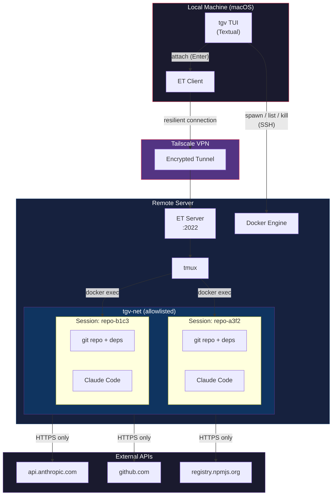
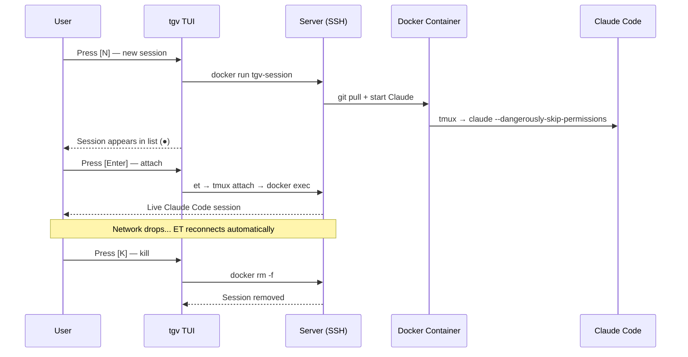
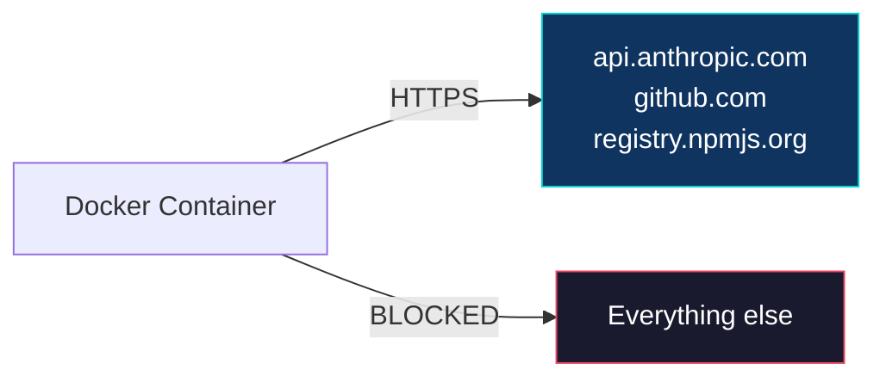

```
░▒▓████████▓▒░  ░▒▓██████▓▒░  ░▒▓█▓▒░░▒▓█▓▒░
   ░▒▓█▓▒░     ░▒▓█▓▒░░▒▓█▓▒░ ░▒▓█▓▒░░▒▓█▓▒░
   ░▒▓█▓▒░     ░▒▓█▓▒░         ░▒▓█▓▒▒▓█▓▒░
   ░▒▓█▓▒░     ░▒▓█▓▒▒▓███▓▒░  ░▒▓█▓▒▒▓█▓▒░
   ░▒▓█▓▒░     ░▒▓█▓▒░░▒▓█▓▒░   ░▒▓█▓▓█▓▒░
   ░▒▓█▓▒░     ░▒▓█▓▒░░▒▓█▓▒░   ░▒▓█▓▓█▓▒░
   ░▒▓█▓▒░      ░▒▓██████▓▒░     ░▒▓██▓▒░

        terminal à grande vitesse
```

# tgv — Terminal à Grande Vitesse

> TGV is brought to you by the Super Naive Code Factory (SNCF). This is a side project and not production ready.

Remote Claude Code session manager for intermittent network environments.

Spawn isolated Claude Code sessions on a remote server, attach and detach
resiliently. Your code keeps running even when your WiFi doesn't.

---

## Requirements

### Local machine (macOS)

| Dependency | Install | Purpose |
|---|---|---|
| Python 3.11+ | `brew install python` | Runs tgv TUI |
| Claude Code | `npm install -g @anthropic-ai/claude-code` | Needed for `claude setup-token` |
| Eternal Terminal | `brew install MisterTea/et/et` | Resilient remote connection (survives network drops) |
| SSH | Pre-installed on macOS | Server communication |
| Tailscale | `brew install tailscale` | VPN access to server (optional) |
| GitHub CLI | `brew install gh` | Required for private repos (`--private` flag) |

### Remote server (Ubuntu/Debian)

| Dependency | Install | Purpose |
|---|---|---|
| Docker | `curl -fsSL https://get.docker.com \| sh` | Container isolation for sessions |
| Eternal Terminal | `sudo add-apt-repository ppa:jgmath2000/et && sudo apt install et` | Server-side ET daemon |
| tmux | `sudo apt install tmux` | Session persistence |
| git | `sudo apt install git` | Repo cloning |

### Authentication

tgv uses your **Claude Max subscription** via OAuth tokens (not API keys — no per-token billing).

During `tgv init`, it runs `claude setup-token` to generate a long-lived OAuth token (valid 1 year)
and deploys it securely to the server.

| Item | Location | Details |
|---|---|---|
| OAuth token (local) | `~/.tgv/oauth_token` | Mode 0600, never committed |
| OAuth token (server) | `~/.config/tgv/oauth_token` | Mode 0600, sourced from `.bashrc` |
| Claude account config | `~/.claude.json` (server) | Onboarding bypass, deployed by `tgv init` |

---

## Installation

```bash
git clone https://github.com/XavierJp/TGV.git
cd TGV

# Install with uv
uv venv && uv pip install -e .

# Or with pip
python -m venv .venv && source .venv/bin/activate && pip install -e .
```

---

## Setup

### 1. Prepare the server (one time)

Install Docker, Eternal Terminal, and tmux on your remote server. You can do this manually or with Ansible if you have playbooks set up.

### 2. Initialize tgv (one time)

```bash
# Public repo
tgv init --host user@<server-ip> --repo https://github.com/org/repo

# Private repo (uses your gh auth token for cloning)
tgv init --host user@<server-ip> --repo https://github.com/org/repo --private

# Custom branch
tgv init --host user@<server-ip> --repo https://github.com/org/repo --branch develop
```

This will:
- Check local dependencies (ssh, et, scp, claude)
- Generate an OAuth token via `claude setup-token` (opens browser)
- Check remote dependencies (docker, tmux, et, git)
- Deploy OAuth token securely to `~/.config/tgv/oauth_token` on the server
- Deploy Claude account config to `~/.claude.json` on the server
- Clone the repo and install deps on the server
- Build the `tgv-session` Docker image (repo + deps baked in)
- Create the `tgv-net` Docker network
- Save local config to `~/.tgv/config.toml`

### 3. Launch the TUI

```bash
tgv
```

---

## Usage

### TUI keybindings

| Key | Action |
|---|---|
| `n` | New session (optional: branch, Claude prompt) |
| `Enter` | Attach to selected session via Eternal Terminal |
| `k` | Kill selected session |
| `r` | Refresh session list |
| `q` | Quit |

### Workflow

1. Press `n` — optionally set a branch or a prompt for Claude
2. A container starts instantly (repo + deps are pre-built in the image)
3. Press `Enter` to attach — you're in a live Claude Code session
4. Close your laptop, lose WiFi, switch networks — doesn't matter
5. Reopen `tgv`, press `Enter` — you're right back where you left off
6. Press `k` when done to clean up

---

## Architecture



### Session lifecycle



### Network isolation



---

## Security

- **No secrets in Docker image layers** — repo is cloned on the host, then `COPY`'d into the image. GitHub tokens never appear in any layer.
- **OAuth token stored securely** — `~/.config/tgv/oauth_token` on the server (mode 0600). Not written directly in `.bashrc`.
- **Private repos** — use `--private` flag explicitly. Token is sourced from `gh auth token` locally, used only for the clone on the server host, then cleaned up.
- **Network allowlist** — containers can only reach `api.anthropic.com`, `github.com`, and `registry.npmjs.org`. Everything else is blocked via iptables.

---

## Configuration

Stored at `~/.tgv/config.toml`:

```toml
[server]
host = "10.0.0.1"
user = "deploy"
et_port = 2022

[docker]
image = "tgv-session:latest"
network = "tgv-net"
allowed_domains = [
    "api.anthropic.com",
    "github.com",
    "*.githubusercontent.com",
    "registry.npmjs.org",
]

[repo]
url = "https://github.com/org/repo"
default_branch = "main"
```

---

## Project structure

```
tgv/
├── pyproject.toml              # Python project config
├── docker/
│   ├── Dockerfile              # Session image (Node 22 + Claude Code + pnpm + gh)
│   └── network-allowlist.sh    # iptables domain allowlist
└── src/tgv/
    ├── cli.py                  # tgv + tgv init entry points
    ├── tui.py                  # Textual TUI
    ├── banner.py               # ASCII banner with gradient
    ├── config.py               # ~/.tgv/config.toml management
    ├── server.py               # SSH/ET remote execution
    └── session.py              # Docker container lifecycle
```

---

## License

MIT
