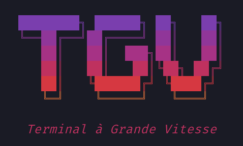

<p align="center">
  
</p>

# TGV — Terminal à Grande Vitesse

In the AI era, a reliable internet connection should be a given. In high-latency environments, such as high-speed rail, unstable internet can make coding sessions frustrating.

Enter TGV, a tool that spawns remote sessions on your workhorse server. 

TGV spins up isolated YOLO containers that run OpenCode with OpenRouter. They run on the remote server which keeps a stable connection even when you don't.

---

## Installation

```bash
git clone https://github.com/XavierJp/TGV.git
cd TGV
./install.sh
```

This builds and installs:
- `tgv` CLI to `~/.cargo/bin/tgv`
- **TGVBar** native macOS menu bar app to `~/.local/bin/TGVBar` (auto-starts on login via LaunchAgent)

## Uninstall

```bash
./uninstall.sh
```

Removes binaries, LaunchAgent, and optionally the `~/.tgv` config directory.

## Usage

The TUI lets you:

- **New session** — pick a branch (or create one), spawn a container
- **Attach** — connect to a running session via mosh/SSH
- **Rename** — label sessions for easy identification
- **Kill** — stop and clean up a session

Inside each session, OpenCode runs with Qwen 3 Coder via OpenRouter. A Zellij split gives you a shell alongside the AI.

Detach with `Ctrl+Q`. Reattach anytime — sessions persist.

## Menu bar app

TGVBar is a native macOS menu bar app that shows your active sessions at a glance.

- Train icon with running session count
- Auto-refreshes every 30s
- Detects network changes (e.g. Tailscale reconnect) and refreshes automatically
- Click **Open TGV** to launch the TUI in Terminal
- Starts automatically on login

## Requirements

**Local machine (macOS)**

- Rust toolchain (for building tgv)
- Swift toolchain (for building TGVBar)
- SSH (pre-installed)
- [mosh](https://mosh.org/) (optional, for resilient connections)
- [GitHub CLI](https://cli.github.com/) (for private repos)

**Remote server (Ubuntu/Debian)**

- [Docker](https://get.docker.com)
- mosh-server (`sudo apt install mosh`)
- git

**API**

- [OpenRouter](https://openrouter.ai) API key

## Setup

```bash
# Public repo
tgv init --host user@<server-ip> --repo https://github.com/org/repo

# Private repo
tgv init --host user@<server-ip> --repo https://github.com/org/repo --private

# Custom branch
tgv init --host user@<server-ip> --repo https://github.com/org/repo --branch develop
```

You'll be prompted for your OpenRouter API key. This builds a Docker image with OpenCode, clones your repo, and installs dependencies.

Then launch:

```bash
tgv
```

## Configuration

Stored at `~/.tgv/config.toml`:

```toml
[server]
host = "10.0.0.1"
user = "deploy"

[docker]
image = "tgv-session:latest"
network = "tgv-net"

[repo]
url = "https://github.com/org/repo"
default_branch = "main"

[git]
name = "Your Name"
email = "you@example.com"
```

## License

MIT
