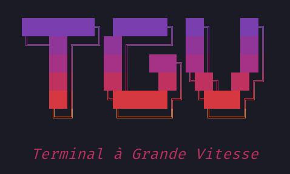

<p align="center">
  
</p>

# TGV — Terminal à Grande Vitesse

In the AI era, a reliable internet connection should be a given. In high-latency environments, such as high-speed rail, unstable internet can make coding sessions frustrating.

Enter TGV, a tool that spawns remote sessions on your workhorse server.

TGV spins up isolated YOLO containers that run OpenCode with OpenRouter. They run on the remote server which keeps a stable connection even when you don't.

---

## What's in the box

- **TGV.app** — native macOS app with embedded SwiftTerm. Sidebar of sessions, center pane runs `abduco + opencode`, side panel has Terminal / Files / Git tabs.
- **tgv-init** — bash script that builds the docker image (with your repo baked in) and writes the config the app reads.
- **docker/Dockerfile** — image with `abduco`, `nvim`, `zsh + oh-my-zsh`, `gh`, `node`, `pnpm`, `uv`, `opencode` all preinstalled.

## Installation

```bash
git clone https://github.com/XavierJp/TGV.git
cd TGV
./install.sh
```

This builds and installs:
- `tgv-init` to `~/.local/bin/tgv-init`
- The Dockerfile to `~/.local/share/tgv/Dockerfile`
- `TGV.app` to `~/.local/bin/TGV` (auto-starts on login via LaunchAgent)

## Setup

```bash
# Public repo
tgv-init --host user@<server-ip> --repo https://github.com/org/repo

# Private repo (requires `gh auth login` locally)
tgv-init --host user@<server-ip> --repo https://github.com/org/repo --private

# Custom branch
tgv-init --host user@<server-ip> --repo https://github.com/org/repo --branch develop
```

`tgv-init` will:
1. Check local + remote dependencies
2. Prompt for your OpenRouter API key
3. Clone the repo on the server, build the docker image with deps installed
4. Create the docker network
5. Save `~/.tgv/config.toml`

Then launch the **TGV** app from your menu bar (or it'll already be running from the LaunchAgent).

## Using the app

- **Sidebar (left)** — list of sessions, `+ New Session` button, host metrics (CPU / GPU / RAM / Disk)
- **Center** — `abduco` running `opencode` for the active session. `Ctrl+Q` to detach.
- **Right panel** — three tabs:
  - **Terminal** — raw `zsh` shell into the same container
  - **Files** — `tree` view of the workspace
  - **Git** — `watch git status` (auto-refreshes every 2s)

Sessions persist across SSH disconnects via abduco, so you can close the app, reopen it, and pick up exactly where you left off.

## Uninstall

```bash
./uninstall.sh
```

Removes binaries, LaunchAgent, and optionally `~/.tgv` config.

## Requirements

**Local machine (macOS 14+)**

- Swift toolchain (for building the app)
- SSH (pre-installed)
- [GitHub CLI](https://cli.github.com/) (for private repos)

**Remote server (Ubuntu/Debian)**

- [Docker](https://get.docker.com)
- git
- An SSH key you can authenticate with from your Mac

**API**

- [OpenRouter](https://openrouter.ai) API key

## Configuration

Stored at `~/.tgv/config.toml`:

```toml
[server]
host = "10.0.0.1"
user = "deploy"

[docker]
image = "tgv-session:latest"
network = "tgv-net"

[repo]
url = "https://github.com/org/repo"
default_branch = "main"

[git]
name = "Your Name"
email = "you@example.com"
```

## Architecture

```
┌─────────────────────────────────────────────┐
│  TGV.app (Swift + SwiftTerm + Citadel SSH)  │
│  ┌──────┬─────────────┬─────────────┐       │
│  │ Side │ Main        │ Side panel  │       │
│  │ bar  │ (abduco +   │ Term/Files/ │       │
│  │      │  opencode)  │ Git tabs    │       │
│  └──────┴─────────────┴─────────────┘       │
└─────────────────────────────────────────────┘
                    │
                    │  Single SSH connection (Citadel)
                    │  Multiplexed PTY exec channels
                    ▼
┌─────────────────────────────────────────────┐
│  Remote server                              │
│  ┌─────────────┐  ┌─────────────┐           │
│  │ container1  │  │ container2  │           │
│  │abduco+opencode│ │abduco+opencode│        │
│  └─────────────┘  └─────────────┘           │
└─────────────────────────────────────────────┘
```

## License

MIT
